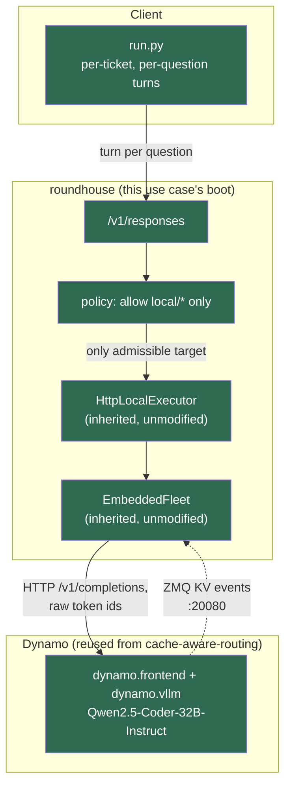

<!--
SPDX-FileCopyrightText: Copyright (c) 2026 NVIDIA CORPORATION & AFFILIATES. All rights reserved.
SPDX-License-Identifier: Apache-2.0
-->

# Gap Analysis — openjev-demo

This use case inherits its entire local-tier foundation from `cache-aware-routing`, whose
`GAPS.md` and `PROGRESS_TRACKER.md` are the authoritative record of what's built there
(`HttpLocalExecutor`, `EmbeddedFleet` wiring, the four `ROUNDHOUSE_LOCAL_*` variables). This
file covers only what's specific to *this* use case.

---

## What works today

| Component | Status |
|---|---|
| roundhouse routing turns to a local Dynamo/Qwen worker | ✅ Inherited from `cache-aware-routing`, unmodified — same `HttpLocalExecutor`, same `EmbeddedFleet` wiring |
| Local-only policy (`allow: ["local/*"]"`) | ✅ Existing `control_config` mechanism, no new code — this use case is the first to actually exercise a local-only (not mixed) policy in a shipped use case |
| Per-question turns sharing a ticket's `state` prefix | ✅ Ordinary `/v1/responses` growing-conversation semantics, same mechanism `cache-aware-routing`'s Tax A uses |
| Answer extraction from free text | ✅ `run.py`'s `parse_answer` — exact-match then substring-match then an honest `UNPARSED(...)` marker |
| Real log-probability option scoring | ✅ **New, 2026-09-28** — `POST /v1/local/score` (`crates/roundhouse-server/src/local_score.rs`), `run_score.py`. Requires `ROUNDHOUSE_LOCAL_ENABLE_SCORE=1` — off by default, on for this use case only. |

---

## Gaps

| Gap | Type | Severity | Where it lives | What it would take |
|---|---|---|---|---|
| ~~No token-level log-probabilities on roundhouse's wire~~ | **Resolved 2026-09-28** | ~~P1~~ | `crates/roundhouse-server/src/local_score.rs` — `POST /v1/local/score` via Dynamo's `nvext.prompt_logprobs` mechanism | Closed — see `INTEGRATION.md` Gap 1's dated addendum |
| ~~No calibrated `confidence`/`probability` in answers~~ | **Resolved 2026-09-28** | ~~P1~~ | `run_score.py` — real `system_one()`, ported verbatim from `open-jev/openjev/systemone.py` | Closed, downstream of the gap above |
| `run.py`'s free-text answers can still fail to parse (`UNPARSED(...)`) | Inherent to prompted classification, now a documented alternative rather than the only path | P3 | `run.py`'s `parse_answer` | `run_score.py` is the real answer; `run.py` is kept as the Option C comparison point `INTEGRATION.md` names |
| `POST /v1/local/score` bypasses the turn engine entirely | Deliberate, not an oversight | P2 | No session, no `/v1/metrics` accounting for scoring calls — see `local_score.rs`'s module doc | Acceptable for a local-tier utility call; would need real turn-engine integration (Option B in `INTEGRATION.md`) if billing/session history for scoring calls ever matters |
| `local_quality`/`correlaries` are cache-aware-routing's placeholders, not validated for this workload | Needs config | P2 | `catalog.json` | Not a routing blocker; this use case's dashboard figures are not the point (see README.md Notes) |
| No second question set / no stress test of longer states | Not built | P3 | `tickets.jsonl` has 5 short tickets | Add more/longer tickets if the cache-reuse story needs a bigger prefix to be convincing |
| **`/v1/local/score`'s one-call-per-option design costs more tokens than it saves** | Measured, 2026-09-28 | **P1** | `run_with_openjev.py` vs `run_without_jev.py`, `results/summary.json` — Jev used **2.1× more total tokens and 2.6× more newly-processed tokens per ticket** than a single structured-JSON-generation call, despite winning decisively on latency (0 ms decode vs 608 ms/ticket) | A batched multi-option scoring call — one prefill shared across all of a question's options in one request, the way `open-jev`'s own `OptionScorer` does in-process — instead of `local_score.rs`'s current per-option HTTP round trip. See `INTEGRATION.md` Gap 1's third addendum. |

Severity:
- **P1** — the demo runs and routes correctly, but the specific claim ("this reproduces
  `open-jev`'s System One contract") is only approximately true
- **P2** — demo runs and the core local-routing claim is solid; secondary numbers are weak
- **P3** — nice-to-have

---

## Architecture diagram

Everything here is green — there is no orange/red "not built" component in the routing path
itself, unlike `cache-aware-routing`'s own diagram before this session's work. As of
2026-09-28, this is also true of answer fidelity: `/v1/local/score` closes the log-probability
gap the diagram's caption used to describe as the remaining weakness. What remains (`run.py`'s
free-text path, still kept as a comparison point; scoring calls not appearing in `/v1/metrics`)
is now deliberate scope, not an unclosed gap.
